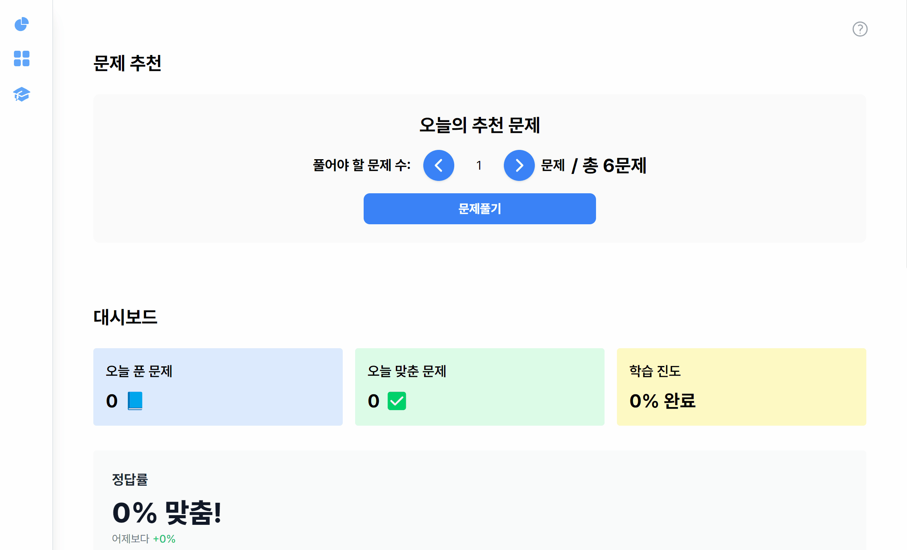
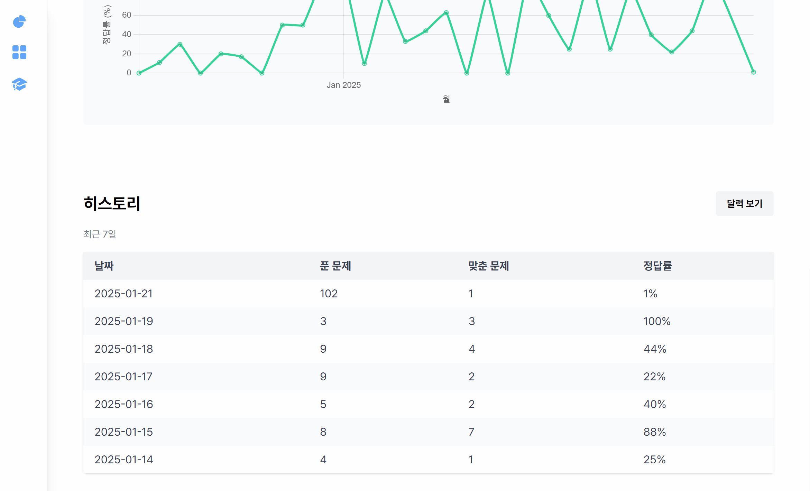
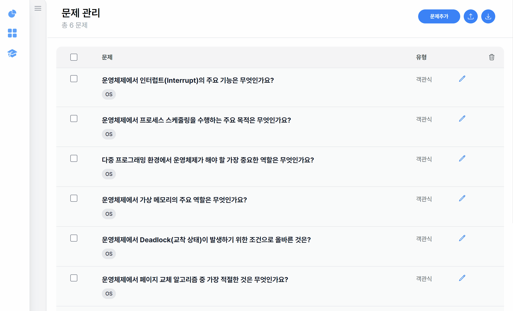
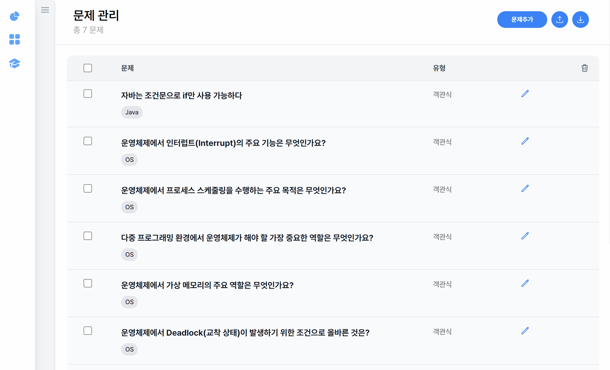
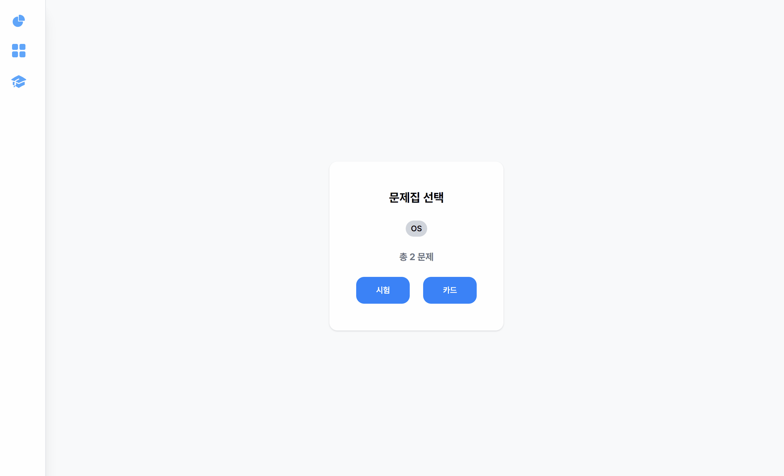

# 문제어때 - 내안의 작은 학습방

* 배포 URL : [HowAboutQuestion](https://howaboutquestion-bucket.s3.us-east-1.amazonaws.com/HowAboutQuestion.zip)
* TEST FILE : [TEST QUESTIONS FILE](https://howaboutquestion-bucket.s3.us-east-1.amazonaws.com/questions.csv) 
* TEST HISTORY : [TEST HISTORY FILE](https://howaboutquestion-bucket.s3.us-east-1.amazonaws.com/history.csv)

## 프로젝트 소개
* 문제 어때는 문제를 직접 제작하고 만든 문제를 직접 풀어 볼 수 있는 학습 프로그램 입니다.
* 스스로 풀어 본 문제들은 기록되며 스스로의 학습량을 분석하고 확인할 수 있습니다.
* 분석된 결과를 통해 학습이 미흡한 문제는 "오늘 풀어야할 문제"에 자주 등장합니다.
* 다양한 테그들을 활용하여 문제를 구분하거나 문제집 별로 테그를 활용해 문제를 분류할 수 있습니다.

## 팀원 소개
|권해림|최은창|
|---|---|
| [   @haerim-kweon](https://github.com/haerim-kweon) | [   @cod0216](https://github.com/cod0216) | 

## 1. 개발 환경
* Node.js
* npm
* Electron
* React
* Recoil
* TailWind CSS
* Chart.js
* 디자인 : Figma
* 협업 툴 : Discord, ZEP, Obsidian

## 2. 역할 분담
### 🐽권해림
* UI
    * 페이지 : 문제 관리, 문제 풀이, 결과

* 기능
    * Question CURD, 확인, 파일 I/O

### 🧙‍♂️최은창
* UI
    * 페이지 : 대시 보드, 문제 추천, 히스토리, 

* 기능
    * History CRU, 문제 추천 로직, 

## 3. 개발 기간 및 관리

### 개발 기간
* 전체 개발 기간 : 2024-12-09 ~ 2025-02-09
* UI 구현 및 기능 구현 : 2024-12-09 ~ 2025-01-09
* 배포 : 2025-01-09 ~ 2025-02-09

### 작업 관리
* GitHub Repo를 사용하여 진행 상항을 공유했습니다.
* 일일 스크럼을 진행하며 작업 순서와 방향성에 대해 고민을 나누고 해결 방안을 모색해 나아가습니다.
* Excalidraw를 이용하여 가시적인 의견과 해결 방안을 제시하였습니다.  

### 데이터 관리
* CSV 파일을 이용하여 데이터를 저장하였습니다.
    * `questions.csv` → 문제 리스트 저장
    * `history.csv` → 풀이 기록 저장
* Electron의 `fs` 모듈을 사용하여 CSV 데이터를 읽고 저장하였습니다.

## 4. 신경 쓴 부분 (수정)
* Recoil을 통한 상태 관리 및 유지
* 문제 생성(이미지 등)
* 문제 추천 로직

## 5. 페이지별 기능

### [대시보드]

#### [문제 추천]
* 내가 제작한 문제들이 추천됩니다.
* 많이 맞을 수록 추천 문제에 덜 등장하게 되고 많이 틀릴수록 추천 문제에 더 자주 등장하게 됩니다.

#### [히스토리]
* 나의 문제 푼 기록을 확인할 수 있습니다.
* 최근 7개의 문제 히스토리 기록을 확인 할 수 있으며 달력을 통해 더 이전의 기록을 확인할 수 있습니다.

### [문제 관리]

#### [문제 추가]
* 문제를 만들 수 있수 있습니다.
* "다음 중 틀린것을 고르시오" 등과 같은 문제를 위해 문제 중복을 허용했습니다.
* 객관식, 주관식을 선택할 수 있습니다.
* 태그 기능을 활용하여 문제집 처럼 문제들을 분류 할 수 있습니다.
* 생성한 객관식 갯수만큼 보기를 만들 수 있으며 최대 4개의 보기를 만들 수 있습니다.
* 이미지 삽입을 통해 사진을 활용한 문제도 제작할 수 있습니다.

#### [문제 삭제]

#### [문제 수정]

#### [문제 업로드]
* 지금까지 생성한 문제들을 zip 파일로 내보낼 수 있습니다.

#### [문제 다운로드]
* 다른 사용자가 생성한 zip파일 문제들을 추가 할 수 있습니다.

### [문제풀기]
* 문제 풀기 페이지는 문제 풀이를 할 수 있습니다.
* 다운로드 하거나 제작한 문제의 테그를 선택해서 문제 풀이를 할 수 있습니다.
* 객관식, 주관식 문제 풀이는 시험을, 카드 형식은 카드를 선택 할 수 있습니다.
* 오늘의 추천 문제를 통해 선택된 문제를 해당 페이지에서 시험, 카드 를 선택해서 문제 풀이를 할 수 있습니다.

#### [시험]
* 답안을 선택 후 우측 하단 좌, 우 기호를 클릭해 다음 문제로 넘어갈 수 있습니다.
* 우측 상단 동그라미를 클릭하면 문제 번호들이 나오며 문제 번호를 클릭해 해당 문제 번호로 이동 할 수 있습니다.
* 제출 버튼을 클릭하면 지금까지 풀었던 문제들과 남아 있는 모든 문제들을 제출합니다.

#### [카드]
* 내가 만든 문제를 카드 형식으로 제공합니다.
* 문제 제목과 사진, 답안을 확인 할 수 있습니다.
* 내가 생각한 답안과 실제 답안을 비교하여 맞춤, 틀림을 선택할 수 있습니다.

## 6. 프로젝트 후기
### 권해림
문제어때를 시작한 건 꽤 충동적인 결정이었다.
SSAFY 부트캠프 때 강사님께서 매일 한 사람씩 지목해 진도에 맞는 문제를 출제하도록 했는데, 그 과정이 꽤 불편했다. 문제를 .word 파일로 만들고, 답안지를 따로 정리하고, 푸는 사람은 A4 용지에 풀이를 작성한 뒤 직접 채점까지 해야 했다. 출제자마다 형식이 제각각이라 정리하기도 어려웠고, 이전에 풀었던 문제를 다시 찾아보기도 불편했다. 무엇보다 SSAFY 시험은 웹에서 진행되는데, 실제 시험 환경과 비슷하게 연습하고 싶었다.

그러다 문제를 출제할 차례가 되었을 때, 문득 엑셀에 문제를 정리한 뒤 웹에서 한 번에 문제를 풀고 채점할 수 있도록 만들면 어떨까 싶었다. "세 번 이상 반복되는 코드는 분리하라"는 말을 종종 듣는데, 재미있게도 내가 딱 세 번째 출제자였던 것 같다. 그렇게 시작한 프로젝트를 발전시켜 결국 데스크탑용 애플리케이션까지 만들게 되었다.
개발자로서 일상의 불편함을 코드로 해결하는 게 하나의 로망이었는데, 드디어 1차적인 형태로나마 완성하게 돼서 정말 뿌듯하다. 물론 아직 부족한 점이 많지만, 직접 만들어서 쓰고 있다는 사실만으로도 기분이 좋다.

### 최은창
이번 프로젝트를 통해 React와 Electron을 활용하며 새로운 기술을 익힐 수 있었습니다. 또한, 대시보드에서 문제를 풀기까지 버튼을 클릭하는 횟수나 첫 화면에 어떤 요소를 배치할지 등 사용자 경험(UX)에 대한 다양한 고민을 팀원과 나눌 수 있는 좋은 기회였습니다. 이 과정에서 사용자의 편의성과 직관적인 인터페이스 설계를 위해 많은 논의를 거쳤으며, 이를 통해 UX/UI의 중요성을 더욱 깊이 깨닫게 되었습니다.

